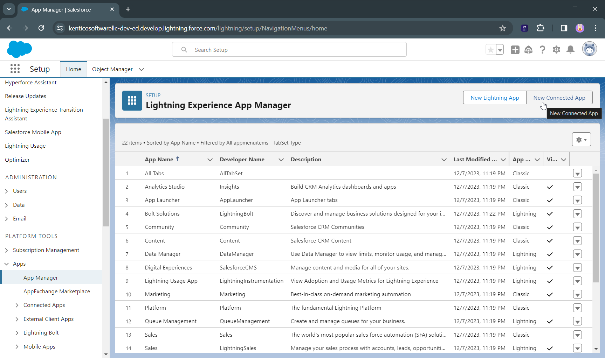
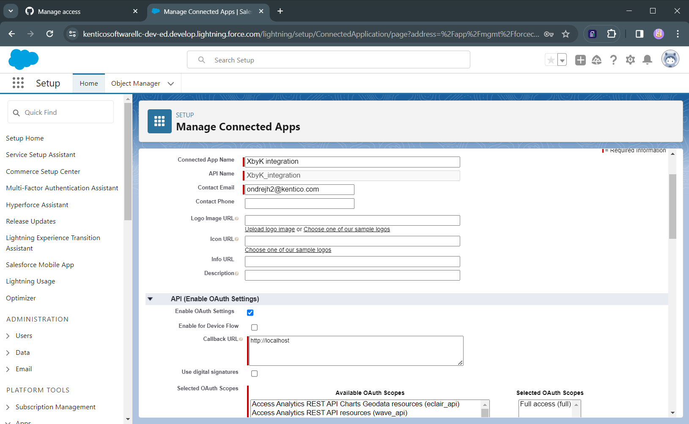
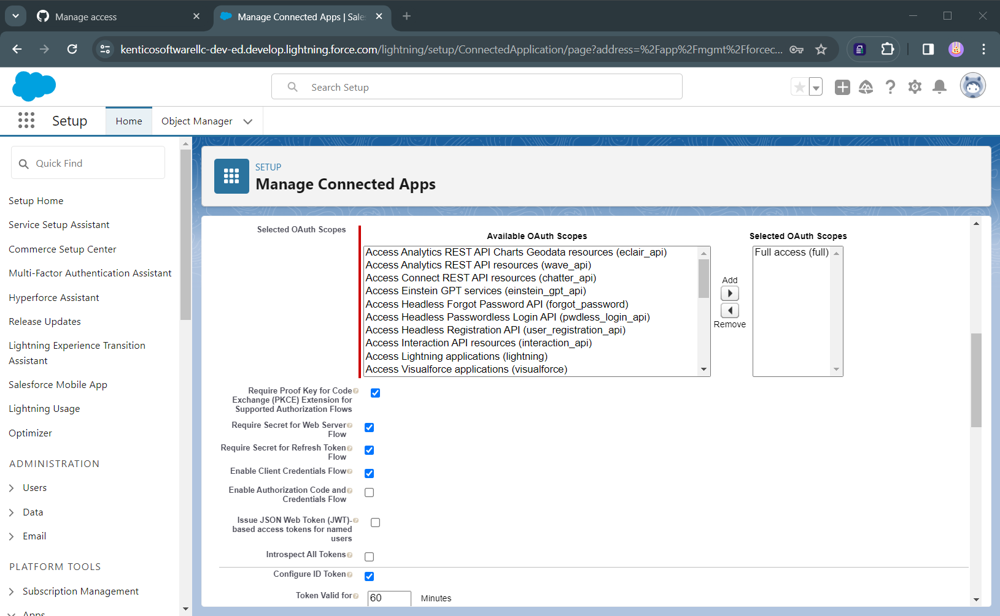
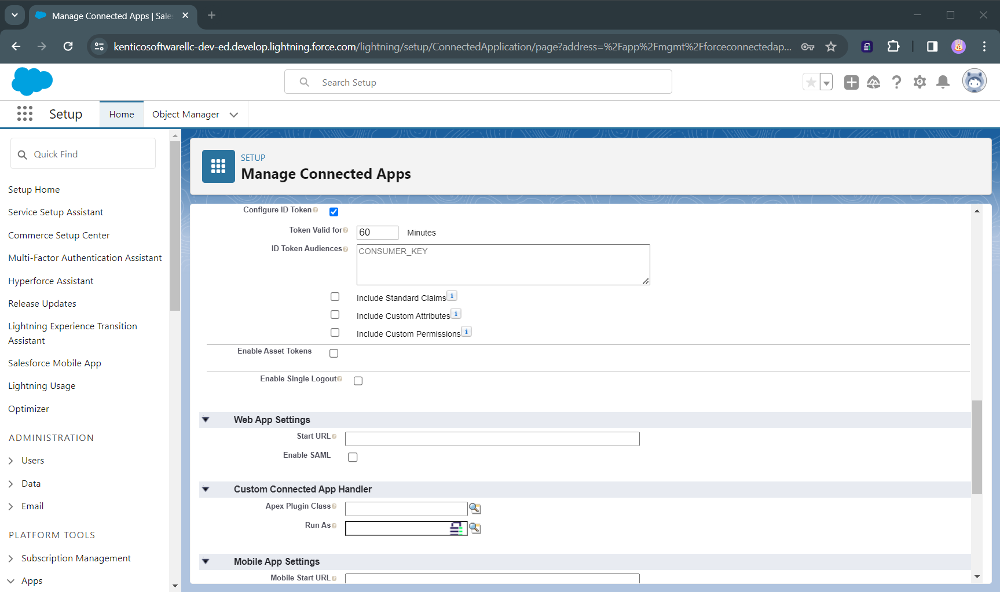
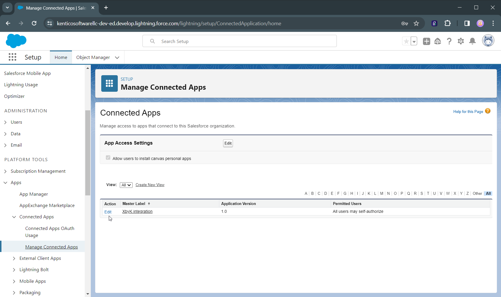
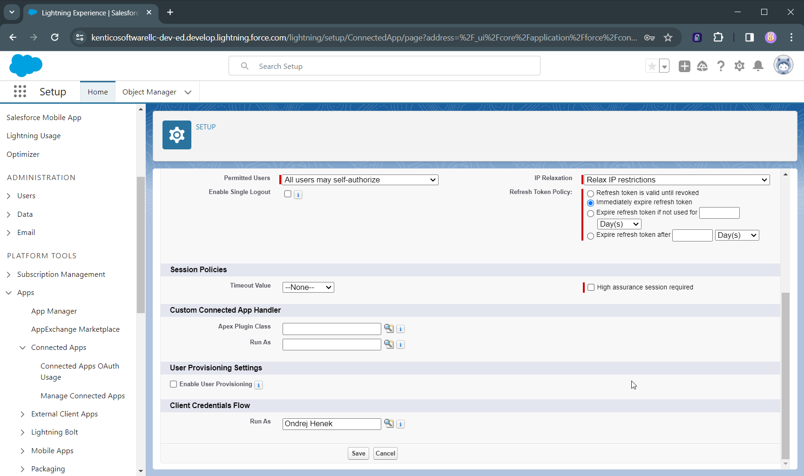
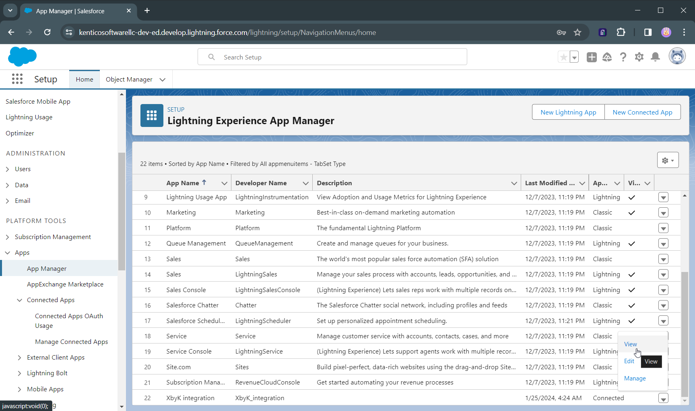
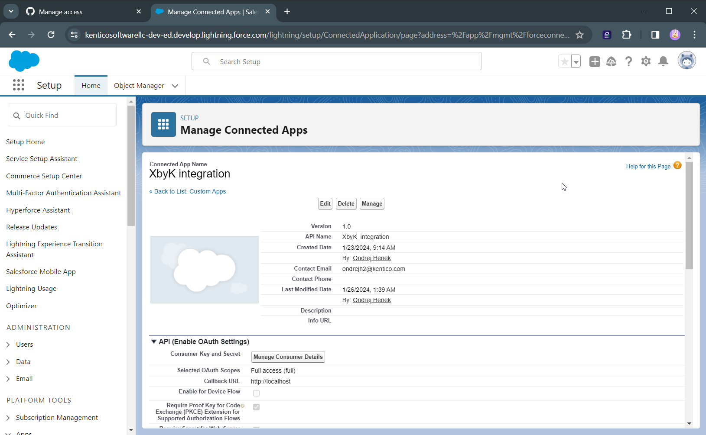
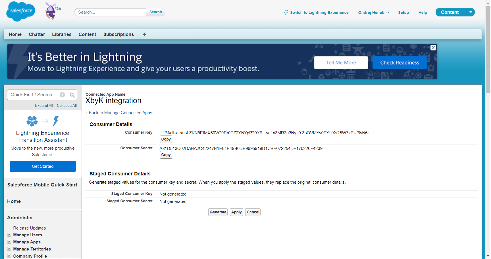

# Salesforce Quick Guide

This guide lets you quickly set up Salesforce App to ingest and send data from Xperience by Kentico CRM integration. The goal of this guide is to quickly demonstrate functionality of this integration - it does not follow best practices and security guidelines.

## Creating Salesforce developer account

Go to [https://developer.salesforce.com/signup](https://developer.salesforce.com/signup) and sign up for a free developer account. It is possible that you already have some account assigned to your work email so feel free to specify and made up Username to start from a scratch.

## Creating the Connected App

Log in, you should land on the Setup screen (or use the cogwheel button in the top right menu).

In the left menu navigate to the *Apps* -> *App Manager* and create a *New Connected App*.

Set up your app following the images below

Now hit save.

## Setting up permissions

Now navigate to the *Apps* -> *Connected App* -> *Manage Connected Apps* and hit *Edit* on your app.

You might want to Relax IP restrictions at the top of the page.

You must set a user on behalf of whom the app will be running. So far there is probably only you, a global admin. This is definitely not a good practice, but for our demo it will suffice.

## Getting the secret

Now navigate back to  *Apps* -> *App Manager*, locate your app and on the right hidden behind the carret hit *View*.

On the detail of the app, click *Manage* button

You will be prompted to verify your email, and then you have your Key and Secret! For the URL use the current domain name from your browser.

