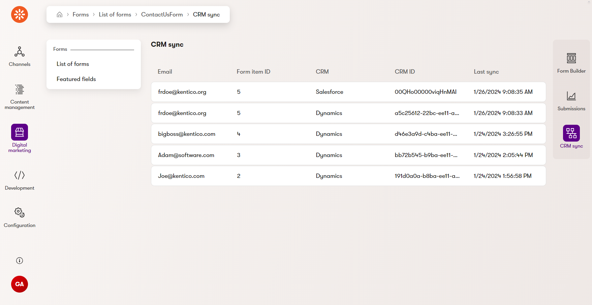
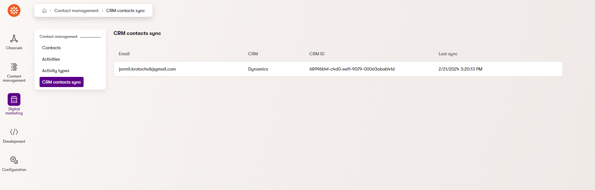
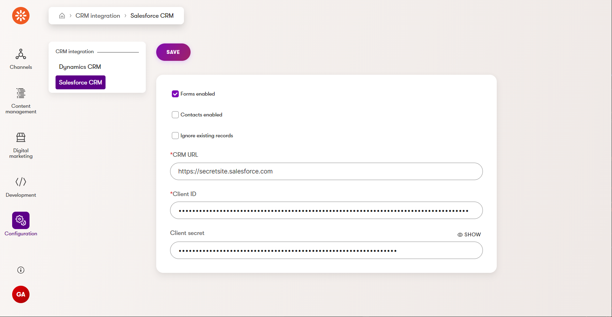

# Usage Guide

## Screenshots





## CRM settings

There are 2 options how to fill settings:

- Use application settings: [appsettings.json](./docs/Usage-Guide.md#crm-settings) (API config is recommended to have in [User Secrets](https://learn.microsoft.com/en-us/aspnet/core/security/app-secrets?view=aspnetcore-6.0&tabs=windows))
- Use CMS settings: CRM integration settings category is created after first run. It is primarily for testing and demo purposes and we do not recommend it due to low security standards.
  This is primary option when you don't specify IConfiguration section during services registration.

Integration uses OAuth client credentials scheme, so you have to setup your CRM environment to enable for using API with client id and client secret:

- [Salesforce Quick Guide by Kentico](./Salesforce-Quick-Guide.md) or generic [Salesforce documentation](https://help.Salesforce.com/s/articleView?id=sf.remoteaccess_oauth_client_credentials_flow.htm&type=5)
- [Dynamics](https://learn.microsoft.com/en-us/power-apps/developer/data-platform/authenticate-oauth)

### CRM settings description

| Setting                       | Description                                                                          |
|-------------------------------| ------------------------------------------------------------------------------------ |
| Forms enabled                 | If enabled form submissions for registered forms are sent to CRM Leads               |
| Contacts enabled              | If enabled online marketing contacts are synced to CRM Leads or Contacts             |
| Contacts two-way sync enabled | If enabled contacts are synced from CRM to Kentico (can set only when previous 'Contacts enabled' setting is true) 
| Ignore existing records       | If enabled then no updates in CRM will be performed on records with same ID or email |
| CRM URL                       | Base Dynamics / Salesforce instance URL                                              |
| Client ID                     | Client ID for OAuth 2.0 client credentials scheme                                    |
| Client secret                 | Client secret for OAuth 2.0 client credentials scheme                                |

### Dynamics settings

Fill settings in CMS or use this appsettings:

```json
{
  "CMSDynamicsCRMIntegration": {
    "FormLeadsEnabled": true,
    "IgnoreExistingRecords": false,
    "ApiConfig": {
      "DynamicsUrl": "",
      "ClientId": "",
      "ClientSecret": ""
    }
  }
}
```

### Salesforce settings

Fill settings in CMS or use this app settings:

```json
{
  "CMSSalesforceCRMIntegration": {
    "FormLeadsEnabled": true,
    "IgnoreExistingRecords": false,
    "ApiConfig": {
      "SalesforceUrl": "",
      "ClientId": "",
      "ClientSecret": ""
    }
  }
}
```

You can also set specific API version for Salesforce REST API (default version is 59).

```json
{
  "CMSSalesforceCRMIntegration:ApiConfig:ApiVersion": 59
}
```

## Forms data - Leads integration

Configure mapping for each form between Kentico Form fields and Dynamics Lead entity fields:

### Dynamics Sales

Added form with auto mapping based on Form field mapping to Contacts atttibutes. Uses CMS settings:

```csharp
 // Program.cs

 var builder = WebApplication.CreateBuilder(args);

 // ...
 builder.Services.AddKenticoCRMDynamics(builder =>
    builder.AddFormWithContactMapping(DancingGoatContactUsItem.CLASS_NAME));
```

Same example but with using app setting in code (**CMS setting are ignored!**):

```csharp
 // Program.cs

 var builder = WebApplication.CreateBuilder(args);

 // ...
 builder.Services.AddKenticoCRMDynamics(builder =>
    builder.AddFormWithContactMapping(DancingGoatContactUsItem.CLASS_NAME),
    builder.Configuration.GetSection(DynamicsIntegrationSettings.ConfigKeyName));
```

Example how to add form with auto mapping combined with custom mapping and custom validation:

```csharp
 // Program.cs

 var builder = WebApplication.CreateBuilder(args);

 // ...
 builder.Services.AddKenticoCRMDynamics(builder =>
    builder.AddFormWithContactMapping(DancingGoatContactUsItem.CLASS_NAME, b => b
            .MapField<DancingGoatContactUsItem, Lead>(c => c.UserMessage, e => e.EMailAddress1))
           .AddCustomValidation<CustomFormLeadsValidationService>());
```

Example how to add form with own mapping:

```csharp
 // Program.cs

 var builder = WebApplication.CreateBuilder(args);

 // ...
 builder.Services.AddKenticoCRMDynamics(builder =>
        builder.AddForm(DancingGoatContactUsItem.CLASS_NAME, //form class name
                c => c
                    .MapField("UserFirstName", "firstname")
                    .MapField<Lead>("UserLastName", e => e.LastName) //you can map to Lead object or use own generated Lead class
                    .MapField<DancingGoatContactUsItem, Lead>(c => c.UserEmail, e => e.EMailAddress1) //generated form class used
                    .MapField<BizFormItem, Lead>(b => b.GetStringValue("UserMessage", ""), e => e.Description) //general BizFormItem used
            ));
```

Example how to add form with custom converter.
Use this option when you need complex logic and need to use another service via DI:

```csharp
 // Program.cs

 var builder = WebApplication.CreateBuilder(args);

 // ...
 builder.Services.AddKenticoCRMDynamics(builder =>
     builder.AddFormWithConverter<SomeCustomConverter>(DancingGoatContactUsItem.CLASS_NAME));
```

### Salesforce

Added form with auto mapping based on Form field mapping to Contacts atttibutes. Uses CMS settings:

```csharp
 // Program.cs

 var builder = WebApplication.CreateBuilder(args);

 // ...
 builder.Services.AddKenticoCRMSalesforce(builder =>
    builder.AddFormWithContactMapping(DancingGoatContactUsItem.CLASS_NAME));
```

Same example but with using app setting in code (**CMS setting are ignored!**):

```csharp
 // Program.cs

 var builder = WebApplication.CreateBuilder(args);

 // ...
 builder.Services.AddKenticoCRMSalesforce(builder =>
    builder.AddFormWithContactMapping(DancingGoatContactUsItem.CLASS_NAME),
    builder.Configuration.GetSection(SalesforceIntegrationSettings.ConfigKeyName));
```

Example how to add form with auto mapping combined with custom mapping and custom validation:

```csharp
 // Program.cs

 var builder = WebApplication.CreateBuilder(args);

 // ...
 builder.Services.AddKenticoCRMSalesforce(builder =>
    builder.AddFormWithContactMapping(DancingGoatContactUsItem.CLASS_NAME, b => b
            .MapField<DancingGoatContactUsItem>(c => c.UserMessage, e => e.Description))
        .AddCustomValidation<CustomFormLeadsValidationService>());
```

Example how to add form with own mapping:

```csharp
 // Program.cs

 var builder = WebApplication.CreateBuilder(args);

 // ...
 builder.Services.AddKenticoCRMSalesforce(builder =>
        builder.AddForm(DancingGoatContactUsItem.CLASS_NAME, //form class name
                c => c
                    .MapField("UserFirstName", "FirstName") //option1: mapping based on source and target field names
                    .MapField("UserLastName", e => e.LastName) //option 2: mapping source name string -> member expression to SObject
                    .MapField<DancingGoatContactUsItem>(c => c.UserEmail, e => e.Email) //option 3: source mapping function from generated BizForm object -> member expression to SObject
                    .MapField<BizFormItem>(b => b.GetStringValue("UserMessage", ""), e => e.Description) //option 4: source mapping function general BizFormItem  -> member expression to SObject
            ));
```

Example how to add form with custom converter.
Use this option when you need complex logic and need to use another service via DI:

```csharp
 // Program.cs

 var builder = WebApplication.CreateBuilder(args);

 // ...
 builder.Services.AddKenticoCRMSalesforce(builder =>
     builder.AddFormWithConverter<SomeCustomConverter>(DancingGoatContactUsItem.CLASS_NAME));
```

## Contacts integration

You can enable synchronization of online marketing contacts (OM_Contact table).
You can choose between Lead and Contact entities in CRM where to sync data (but only one option is supported at any given time).

### Dynamics Sales

Basic example how to init (default mapping from ContactInfo to CRM entity is used):

```csharp
 // Program.cs
 var builder = WebApplication.CreateBuilder(args);
 // Choose between sync to Leads and Contacts (only one option is supported)!
 // Add sync to Leads
 builder.Services.AddKenticoCRMDynamicsContactsIntegration(crmType: ContactCRMType.Lead);
 // Add sync to Contacts
 builder.Services.AddKenticoCRMDynamicsContactsIntegration(crmType: ContactCRMType.Contact);
```

Example how to init sync to Leads with custom mapping:

```csharp
 // Program.cs
 var builder = WebApplication.CreateBuilder(args);
 // ...
 // Choose between sync to Leads and Contacts (only one option is supported)!
 builder.Services.AddKenticoCRMDynamicsContactsIntegration(crmType: ContactCRMType.Lead, builder =>
            builder.MapField(nameof(ContactInfo.ContactEmail), "emailaddress1")
                .MapField(c => c.ContactFirstName, "firstname")
                .MapField<Lead>(nameof(ContactInfo.ContactLastName), e => e.LastName)
                .MapField<Lead>(c => c.ContactMobilePhone, e => e.MobilePhone),
            useDefaultMappingToCRM: false);
```

For most advanced scenarios when you need to use injected services, custom converters are recommended:

First create custom converter (example from ContactInfo to Lead):

```csharp
public class DynamicsContactToLeadCustomConverter : ICRMTypeConverter<ContactInfo, Lead>
{
    public Task Convert(ContactInfo source, Lead destination)
    {        
        //to do some mapping
        destination.EMailAddress1 = source.ContactEmail;
        // ...
        return Task.CompletedTask;
    }
}
```
Then initialize integration with custom converter:
```csharp
 // Program.cs
 var builder = WebApplication.CreateBuilder(args);
 // ...
 // Sync to Leads (only one option is supported)!
 builder.Services.AddKenticoCRMDynamicsContactsIntegration(crmType: ContactCRMType.Lead, builder =>
            builder.AddContactToLeadConverter<DynamicsContactToLeadCustomConverter>(),
            useDefaultMappingToCRM: false); // when true default mapping is applied after custom converter
 
 // Sync to Contacts (only one option is supported)!
  builder.Services.AddKenticoCRMDynamicsContactsIntegration(crmType: ContactCRMType.Contact, builder =>
            builder.AddContactToContactConverter<DynamicsContactToContactCustomConverter>(),
            useDefaultMappingToCRM: false); // when true default mapping is applied after custom converter
```

#### Sync from CRM to Kentico

Contacts are synced each minute from CRM (from Leads or Contacts) when setting 'Contacts two-way sync enabled' is checked.
By default existing contacts (paired by email) are updated and new contacts are created (default mapping is used). 
Update is performed only when some data has changed.\
But you can customize this process with custom converter:

```csharp
public class DynamicsContactToKenticoContactCustomConverter : ICRMTypeConverter<Contact, ContactInfo>
{
    public Task Convert(Contact source, ContactInfo destination)
    {
        if (destination.ContactID == 0)
        {
            // mapping on create
            destination.ContactEmail = source.EMailAddress1;
            destination.ContactFirstName = source.FirstName;
            destination.ContactLastName = source.LastName;
        }
        else
        {
            // mapping on update
            destination.ContactNotes = $"Status: {source.StatusCode?.ToString()}";
        }
        
        return Task.CompletedTask;
    }
}
```

```csharp
// Program.cs
var builder = WebApplication.CreateBuilder(args);
// ...
builder.Services.AddKenticoCRMDynamicsContactsIntegration(crmType: ContactCRMType.Contact, builder =>
            builder.AddContactToKenticoConverter<DynamicsContactToKenticoContactCustomConverter>(),
            useDefaultMappingToKentico: false); // when true then both (custom and default) converter are applied
```

### Salesforce

Basic example how to init (default mapping from ContactInfo to CRM entity is used):
```csharp
 // Program.cs
 var builder = WebApplication.CreateBuilder(args);
 // Choose between sync to Leads and Contacts (only one option is supported)!
 // Add sync to Leads
 builder.Services.AddKenticoCRMSalesforceContactsIntegration(crmType: ContactCRMType.Lead);
 // Add sync to Contacts 
 builder.Services.AddKenticoCRMSalesforceContactsIntegration(crmType: ContactCRMType.Contact);
```

Example how to init sync to Leads with custom mapping:

```csharp
 // Program.cs
 var builder = WebApplication.CreateBuilder(args);
 // ...
 // Choose between sync to Leads and Contacts (only one option is supported)!
 builder.Services.AddKenticoCRMSalesforceContactsIntegration(crmType: ContactCRMType.Lead, builder =>
            builder.MapField(nameof(ContactInfo.ContactEmail), "Email")
                .MapField(c => c.ContactFirstName, "FirstName")
                .MapLeadField(nameof(ContactInfo.ContactLastName), e => e.LastName)
                .MapLeadField(c => c.ContactMobilePhone, e => e.MobilePhone),
            useDefaultMappingToCRM: false);
```

For most advanced scenarios when you need to use injected services, custom converters are recommended:

First create custom converter (example from ContactInfo to Lead):

```csharp
public class SalesforceContactToLeadCustomConverter : ICRMTypeConverter<ContactInfo, LeadSObject>
{
    public Task Convert(ContactInfo source, LeadSObject destination)
    {        
        //to do some mapping
        destination.Email = source.ContactEmail;

        return Task.CompletedTask;
    }
}
```
Then initialize integration with custom converter:
```csharp
 // Program.cs
 var builder = WebApplication.CreateBuilder(args);
 // ...
 // Sync to Leads (only one option is supported)!
 builder.Services.AddKenticoCRMSalesforceContactsIntegration(crmType: ContactCRMType.Lead, builder =>
            builder.AddContactToLeadConverter<SalesforceContactToLeadCustomConverter>(),
            useDefaultMappingToCRM: false); // when true default mapping is applied after custom converter
 
 // Sync to Contacts (only one option is supported)!
 builder.Services.AddKenticoCRMSalesforceContactsIntegration(crmType: ContactCRMType.Lead, builder =>
            builder.AddContactToContactConverter<SalesforceContactToContactCustomConverter>(),
            useDefaultMappingToCRM: false); // when true default mapping is applied after custom converter
```

#### Duplicates detection issue

By default Salesforce has duplicates detection enabled. Collisions can be detected even between records in Leads and Contacts.\
For this reason, we do not recommend using the synchronization of form submissions and synchronization of contacts at the same time unless duplicate detection is turned off.\
More about [Standard Duplicate Rules](https://help.salesforce.com/s/articleView?id=sf.duplicate_rules_standard_rules.htm&type=5)

#### Sync from CRM to Kentico

Contacts are synced each minute from CRM (from Leads or Contacts) when setting 'Contacts two-way sync enabled' is checked.
By default existing contacts (paired by email) are updated and new contacts are created (default mapping is used).
Update is performed only when some data has changed.\
But you can customize this process with custom converter:

```csharp
public class SalesforceLeadToKenticoContactCustomConverter : ICRMTypeConverter<LeadSObject, ContactInfo>
{
    public Task Convert(LeadSObject source, ContactInfo destination)
    {
        if (destination.ContactID == 0)
        {
            // mapping on create
            destination.ContactEmail = source.Email;
            destination.ContactFirstName = source.FirstName;
            destination.ContactLastName = source.LastName;
        }
        else
        {
            // mapping on update
            destination.ContactNotes = $"Status: {source.Status}";
        }
        
        return Task.CompletedTask;
    }
}}
```

```csharp
// Program.cs
var builder = WebApplication.CreateBuilder(args);
// ...
builder.Services.AddKenticoCRMSalesforceContactsIntegration(crmType: ContactCRMType.Lead, builder =>
            builder.AddLeadToKenticoConverter<SalesforceLeadToKenticoContactCustomConverter>(),
            useDefaultMappingToKentico: false); // when true then both (custom and default) converter are applied
```

## Troubleshooting

- When uprading from version 1.0.0 and database objects has been already created, you need to manually change
  [FailedSyncItemNextTime] column as nullable in table [KenticoCRMCommon_FailedSyncItem] to prevent errors in thread worker after
  10 failed attempts were performed.
  \
  Another solution for this issue is drop table and remove record in CMS_Class (ClassName: KenticoCRMCommon.FailedSyncItem) and let install table again after restarting application.


